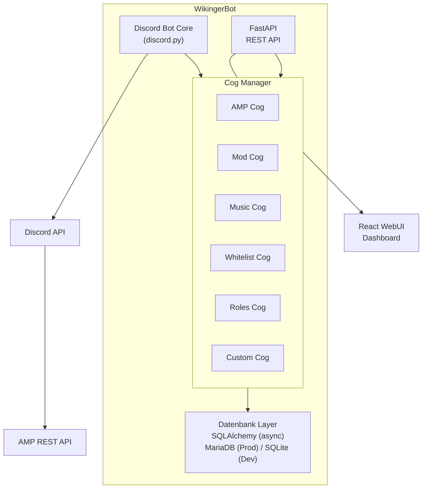

# WikingerBot — Projektdokumentation
*Eigener Discord Bot für den Wikinger Server*

> Für die einmaligen Setup-Schritte (Discord-Bot anlegen, einladen, Rollen-Hierarchie) siehe [SETUP.md](SETUP.md).
> Für eine vollständige Liste aller Slash-Commands mit Beschreibung und benötigtem Berechtigungslevel siehe [COMMANDS.md](COMMANDS.md).

---

## Projektstatus

| Phase | Inhalt | Status |
|---|---|---|
| Phase 1 | Bot Core, Cog-Manager, Datenbankmodelle, Berechtigungssystem, FastAPI-Grundstruktur | ✅ fertig |
| Phase 2 | `amp`-Cog, `moderation`-Cog, `whitelist`-Cog | ✅ fertig |
| — | Konsolen-Filter (Blacklist/Whitelist) + Event-Kanal für den `amp`-Cog | ✅ fertig |
| — | `banner`-Cog (Embed/Bild-Banner, Steam-Artwork, Banner-Gruppen, Editor-UI) | ✅ fertig |
| Phase 3 | React-WebUI | ⏳ offen |
| Phase 4 | `roles`-, `welcome`-Cog, weitere Erweiterungen | ⏳ offen |

Alle fertigen Teile sind gegen einen echten AMP-Server und einen Test-Discord-Server live verifiziert (nicht nur Unit-Tests).

---

## Projektziel

Ablösung von GatekeeperV2, Red Discord Bot und Sinusbot durch einen einheitlichen, selbst entwickelten Bot mit:
- Einheitlichem Berechtigungssystem
- Einheitlicher Datenbank
- Discord Slash-Commands als primäres Interface
- WebUI für detaillierte Konfiguration und Übersichten
- Cog-basierter Erweiterbarkeit

---

## Tech-Stack

| Komponente | Technologie | Begründung |
|---|---|---|
| Sprache | Python 3.11+ | Ausgereift, Red als Referenz, gute AMP-Unterstützung |
| Discord Library | discord.py | Größte Community, beste Dokumentation |
| REST API / Backend | FastAPI | Async-nativ, automatische API-Docs, sauber trennbar |
| WebUI Frontend | React | Modern, erweiterbar, bereits bekannt |
| Datenbank (Prod) | MariaDB | Läuft bereits in k3s |
| Datenbank (Dev) | SQLite | Einfach, kein Overhead lokal |
| ORM | SQLAlchemy (async) | Unterstützt MariaDB und SQLite, Datenbankwechsel einfach |
| AMP Integration | ampapi (Python) | Offizieller Wrapper für CubeCoders AMP REST API |
| Hosting | k3s oder AMP-Instanz | Beides möglich |

---

## Architektur-Übersicht



---

## Ordnerstruktur

Tatsächlicher aktueller Stand (Phase 1+2). `web/`, `docker/`, `k8s/` aus der
ursprünglichen Planung existieren noch nicht (Phase 3/4).

```
Wikingerbot/
├── bot/
│   ├── main.py                 # Einstiegspunkt
│   ├── core/
│   │   ├── bot.py              # Bot-Klasse, Cog-Manager
│   │   ├── config.py           # Konfiguration (Env-Variablen)
│   │   ├── base_cog.py         # BaseCog
│   │   ├── permissions.py      # Berechtigungssystem (Level, require_role, ...)
│   │   ├── amp_client.py       # AMP-Controller-/Pro-Instanz-Sessions
│   │   ├── console_filters.py  # Eingebaute Konsolen-Filter-/Event-Muster
│   │   ├── entities.py         # ensure_guild/ensure_user (FK-Sicherheit)
│   │   ├── guild_config.py     # GuildConfig get/set
│   │   ├── bot_settings.py     # BotSetting get/set (globale, nicht guild-gebundene Schalter)
│   │   ├── steam_art.py        # Steam-Store-Artwork ueber die App-ID (aus AMPs DisplayImageSource) - von amp+banner-Cog genutzt
│   │   └── discord_utils.py    # send_temp_followup (auto-loeschende Ephemeral-Replies)
│   └── cogs/
│       ├── admin/cog.py        # /bot cog ..., /bot sync, /bot sync_on_startup
│       ├── amp/cog.py          # /server ... (Start/Stop/Status/Console/Chat-Bridge/Filter/Steam-AppID)
│       ├── moderation/cog.py   # /kick /ban /timeout /warn /modlog /modconfig
│       ├── whitelist/cog.py    # /whitelist ...
│       └── banner/              # /banner ... /bannergroup ... (Status-Banner, Editor-UI)
│           ├── cog.py           # Commands, Views, Posting-/Update-Loop
│           ├── themes.py        # Eingebaute Verlaufs-Themes, Presets, Blur-Level
│           ├── image.py         # Pillow-Rendering der Bild-Banner-Variante
│           └── embed.py         # Embed-Rendering der Embed-Banner-Variante
│
├── api/                         # FastAPI Backend (Grundstruktur, fuer Phase 3 WebUI)
│   ├── main.py
│   ├── routers/
│   │   ├── health.py
│   │   └── auth.py             # Discord-OAuth2-Login
│   └── middleware/auth.py
│
├── db/
│   ├── base.py                  # SQLAlchemy Base
│   ├── session.py                # DB Session Management
│   ├── models/                   # siehe Datenbankschema oben
│   └── migrations/               # Alembic
│
├── tests/
├── .env.example
├── SETUP.md
├── COMMANDS.md
└── requirements.txt
```

**Noch nicht existent** (spätere Phasen): `web/` (React-Frontend), `docker/`,
`k8s/` — sobald Phase 3/4 beginnt, werden sie analog zur ursprünglichen
Planung ergänzt.

---

## Cog-Interface

Jedes Cog erbt von `BaseCog` (`bot/core/base_cog.py`):

```python
class BaseCog(commands.Cog):
    """Basis-Klasse fuer alle WikingerBot Cogs."""

    __cog_name__: str
    __version__: str
    __description__: str
    __author__: str

    def __init__(self, bot: commands.Bot) -> None:
        self.bot = bot
        self.config = settings  # bot/core/config.py, schreibgeschuetzt

    async def cog_load(self) -> None: ...
    async def cog_unload(self) -> None: ...
```

Abweichung von der ursprünglichen Planung: kein `self.db` (eine langlebige
DB-Session wäre ein Anti-Pattern für async SQLAlchemy) und kein `cog_check`
(gilt für klassische Prefix-Commands; wir nutzen Slash-Commands, daher läuft
die Berechtigungsprüfung über den `@require_role(...)`-Decorator direkt am
Command, siehe `bot/core/permissions.py`).

Groups (`app_commands.Group`, z.B. `/server`, `/bot`, `/whitelist`) müssen als
**Klassen-Attribut** definiert werden, nicht als Modul-Level-Variable —
sonst bindet discord.py sie nicht korrekt an die Cog-Instanz.

**Cog laden/entladen per Discord-Command:**
```
/bot cog load name:moderation
/bot cog unload name:moderation
/bot cog reload name:moderation
/bot cog list
/bot sync local:True
```

---

## Datenbankschema

Das tatsächliche Schema lebt als SQLAlchemy-Modelle in `db/models/` (nicht
hier als SQL dupliziert, damit diese Doku nicht bei jeder Migration
veraltet). Migrationen liegen in `db/migrations/versions/`. Kurzüberblick
der Tabellen:

| Modell | Datei | Zweck |
|---|---|---|
| `Guild` | `guild.py` | Bekannte Discord-Server |
| `User` | `user.py` | Discord-Nutzer, inkl. zuletzt genutztem IGN, Donator-Status |
| `GuildRole` | `role.py` | Discord-Rolle → Berechtigungslevel |
| `Server` | `server.py` | AMP-Instanz, Kanäle, Konsolen-Filter-Modus, Banner-Konfiguration, Steam-App-ID |
| `BannerGroup` | `banner_group.py` | Mehrere Server in einem gemeinsamen Banner (kombiniert oder je Mitglied einzeln) |
| `ConsolePattern` / `ConsolePatternOverride` | `console_pattern.py` | Eigene Regex-Muster / deaktivierte eingebaute Muster |
| `ModLogEntry` / `Warning` | `modlog.py` | Moderationshistorie, Verwarnungen mit Punktesystem |
| `WhitelistRequest` | `whitelist.py` | Whitelist-Anfragen inkl. Review-Nachricht |
| `GuildConfig` | `config.py` | Key-Value-Konfiguration pro Guild |
| `BotSetting` | `bot_setting.py` | Key-Value-Konfiguration global (nicht guild-gebunden), z.B. `sync_globally_on_startup` |
| `WebSession` | `web_session.py` | Refresh-Tokens für den WebUI-Login (Phase 3, noch ungenutzt) |

---

## Berechtigungssystem

```
Owner   → Alles, kann Admins ernennen
Admin   → Alles außer Owner-Aktionen, kann Mods ernennen
Mod     → Moderation, Server steuern, Whitelist verwalten
Member  → Status sehen, Whitelist beantragen, Chat
```

Implementierung als Decorator (`bot/core/permissions.py`):

```python
from bot.core.permissions import Level, require_role

@app_commands.command()
@require_role(Level.MOD)        # Mindestens Mod
async def kick(self, interaction, user: discord.Member, reason: str):
    ...

@app_commands.command()
@require_role(Level.OWNER)      # Nur Owner (oder Discord-Administrator)
async def server_add(self, interaction, ...):
    ...
```

Für `discord.ui.View`-Button-Callbacks (z.B. Whitelist-Accept/Deny,
Warn-Eskalations-Buttons) gibt es das Pendant `check_level_interaction(...)`,
da `require_role` auf `app_commands.Command` zugeschnitten ist.

---

## Cogs (v1)

| Cog | Ersetzt | Features | Status |
|---|---|---|---|
| `amp` | GatekeeperV2 | Start/Stop/Status, Console-/Chat-Bridge, Konsolen-Filter, Event-Kanal | ✅ fertig |
| `moderation` | Red (teilweise) | Kick/Ban/Warn/Timeout, ModLog, automatische Warn-Eskalation | ✅ fertig |
| `whitelist` | GatekeeperV2 | Anfragen über Accept/Deny-Buttons, AMP-Whitelist, Rollen-Vergabe | ✅ fertig (kein Auto-Approve, immer Mod-Freigabe) |
| `banner` | GatekeeperV2 | Embed-/Bild-Status-Banner, Steam-Artwork, Banner-Gruppen (kombiniert/einzeln), Editor-UI | ✅ fertig |
| `roles` | Red (teilweise) | Autorole, Rollen-Management | ⏳ offen |
| `welcome` | Red (teilweise) | Willkommensnachrichten, Join-Events | ⏳ offen |

**Spätere Cogs (v2+):**

| Cog | Features |
|---|---|
| `music` | Musik-Wiedergabe (ersetzt Sinusbot) |
| `stats` | Server-Statistiken, Aktivitäts-Tracking |
| `trivia` | Quiz-System |
| `automod` | Automatische Moderation |

---

## WebUI Seiten

| Seite | Inhalt |
|---|---|
| Dashboard | Server-Übersicht, Online-Status, Spielerzahlen |
| Server | AMP-Instanzen verwalten, Start/Stop, Console-Log |
| Moderation | ModLog ansehen, Verwarnungen, gebannte User |
| Whitelist | Anfragen verwalten, genehmigen/ablehnen |
| Benutzer | User-Datenbank, Rollen, Steam-IDs |
| Einstellungen | Bot-Konfiguration, Cogs laden/entladen |

---

## Hosting

### Option A — k3s (empfohlen)
```yaml
# 3 Deployments:
# - wikingerbot-discord   (Bot Core)
# - wikingerbot-api       (FastAPI)
# - wikingerbot-web       (React via nginx)
# + MariaDB bereits vorhanden
```

### Option B — AMP-Instanz
```
# Generic Module in AMP
# Bot Core + FastAPI als ein Prozess
# SQLite statt MariaDB
```

---

## Entwicklungsplan

**Phase 1 — Grundgerüst** ✅
- Bot Core + Cog-Manager
- Datenbankmodelle + Migrationen
- Berechtigungssystem
- FastAPI Grundstruktur

**Phase 2 — Kern-Cogs** ✅
- AMP Cog (ersetzt GatekeeperV2) inkl. Konsolen-Filter + Event-Kanal
- Moderation Cog
- Whitelist Cog
- Banner Cog (Embed/Bild, Steam-Artwork, Banner-Gruppen, Editor-UI)

**Phase 3 — WebUI** (offen)
- React Dashboard
- Server-Übersicht
- ModLog + Whitelist Ansicht

**Phase 4 — Erweiterungen** (offen)
- Roles Cog
- Welcome Cog
- Weitere Cogs nach Bedarf

---

*WikingerBot | Daywalker91 | Stand: Juli 2026*
