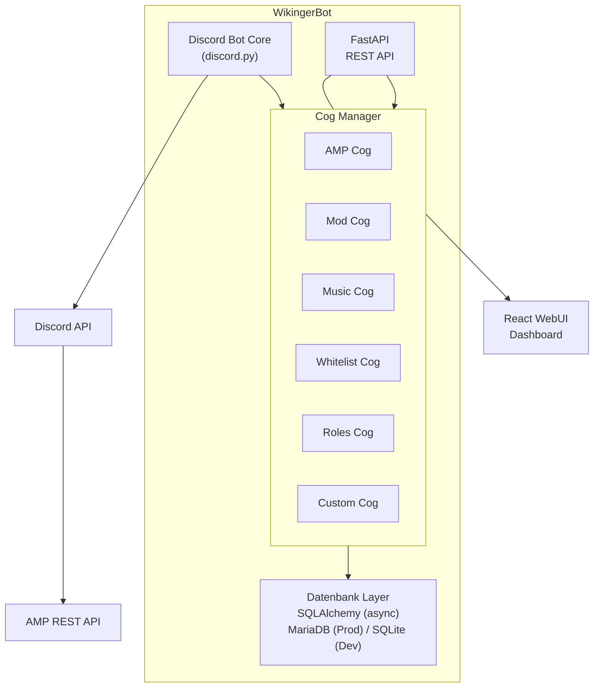

# WikingerBot — Projektdokumentation
*Discord-Bot für Gaming-Communities: AMP-Gameserver steuern, Moderation, Musik, Statistik –
optional gekoppelt an eine eigene Community-Webseite.*

> Für die einmaligen Setup-Schritte (Discord-Bot anlegen, einladen, Rollen-Hierarchie) siehe [SETUP.md](SETUP.md).
> Für eine vollständige Liste aller Slash-Commands mit Beschreibung und benötigtem Berechtigungslevel siehe [COMMANDS.md](COMMANDS.md).
> Für die Nutzung des Status-Banners siehe [BANNER.md](BANNER.md), für die Konsolen-Filter/Event-Erkennung (inkl. Regex-Grundlagen) siehe [CONSOLE_FILTERS.md](CONSOLE_FILTERS.md).
> Für die Anleitung, ein neues Cog (inkl. optionaler WebUI-Seite) zu erstellen, siehe [CREATING_A_COG.md](CREATING_A_COG.md).

---

## Projektstatus

| Phase | Inhalt | Status |
|---|---|---|
| Phase 1 | Bot Core, Cog-Manager, Datenbankmodelle, Berechtigungssystem, FastAPI-Grundstruktur | ✅ fertig |
| Phase 2 | `amp`-Cog, `moderation`-Cog, `whitelist`-Cog | ✅ fertig |
| — | Konsolen-Filter (Blacklist/Whitelist) + Event-Kanal für den `amp`-Cog | ✅ fertig |
| — | `banner`-Cog (Embed/Bild-Banner, Steam-Artwork, Banner-Gruppen, Editor-UI) | ✅ fertig |
| Phase 3 | React-WebUI | ✅ läuft im Bot-Prozess (optional https über einen Reverse-Proxy): Dashboard, Server, Moderation, Whitelist, Einstellungen und je ein Tab pro Cog; Benutzer-Seite offen |
| — | Betrieb in AMP: eigene Vorlage, Migrationen beim Start, MariaDB getestet ([AMP.md](AMP.md)) | ✅ fertig |
| Phase 4 | `welcome`, `roles`, `music`, `stats`, `automod` | ✅ fertig (Tests ohne Discord; live in Discord noch zu prüfen) |
| Phase 5 | Kopplung mit der Community-Seite als eigene, abschaltbare Cogs: `community`, `news`, `events`, `tickets`, `rangsync`, `wiki`, `forum`, `ampkonten`, `rollenanfragen` | ✅ fertig (Tests ohne Discord; im Betrieb erprobt: Anbindung, Verknüpfung) |
| — | Discord-Community-Funktionen: Ankündigungskanal, Mitgliedschaftsprüfung, Ticket-Forum mit Tags | ✅ fertig |

Phase 1–3 sind gegen einen echten AMP-Server und einen Discord-Server live erprobt (nicht nur Unit-Tests). Die Cogs aus Phase 4 und 5 sind mit Unit-Tests abgesichert (Befehle laden, Regeln, Datenbank, echter FFmpeg-Lauf, nachgebaute Discord-/AMP-/Seiten-Gegenstellen); im Betrieb erprobt sind davon bisher die Anbindung und Verknüpfung.

Grundsatz: Der Bot läuft auch **ohne** die Community-Seite – alles, was mit ihr zusammenarbeitet, kommt in eigene Cogs, die man weglassen kann.

### Community-Seite (optional)

Die Community-Cogs (`community`, `news`, `events`, `tickets`, `rangsync`, `wiki`, `forum`, `ampkonten`, `rollenanfragen`)
arbeiten mit einer Community-Webseite zusammen – über deren Datenbank, nicht über HTTP: Die Seite
schreibt Aufträge in eine Tabelle `bot_outbox`, der Bot holt sie ab und schreibt nur in wenige,
spaltengenau freigegebene Tabellen zurück. Erwartet wird das Datenbankschema der zugehörigen
PHP-Community-Seite (eigenes Projekt; Tabellen wie `users`, `roles`, `news`, `events`, `tickets`,
`wiki_pages` und ihre Migrationen ab `008_discord`, u.a. Zusatzrollen und Rollenanfragen). Die nötigen Datenbank-Rechte
stehen in [docs/community-grants.sql](docs/community-grants.sql), die Einrichtung in
[AMP.md](AMP.md#community-seite-anbinden-optional). Ohne Seite bleiben diese Cogs untätig.

---

## Projektziel

Ein einheitlicher, selbst entwickelter Bot statt mehrerer Einzel-Bots (Gameserver-Verwaltung, Moderation, Musik) mit:
- Einheitlichem Berechtigungssystem
- Einheitlicher Datenbank
- Discord Slash-Commands als primäres Interface
- WebUI für detaillierte Konfiguration und Übersichten
- Cog-basierter Erweiterbarkeit

---

## Tech-Stack

| Komponente | Technologie | Begründung |
|---|---|---|
| Sprache | Python 3.11+ | Ausgereift, Red als Referenz, gute AMP-Unterstützung |
| Discord Library | discord.py | Größte Community, beste Dokumentation |
| REST API / Backend | FastAPI | Async-nativ, automatische API-Docs, sauber trennbar |
| WebUI Frontend | React | Modern, erweiterbar, bereits bekannt |
| Datenbank (Prod) | MariaDB / MySQL | Für den Betrieb empfohlen |
| Datenbank (Dev) | SQLite | Einfach, kein Overhead lokal |
| ORM | SQLAlchemy (async) | Unterstützt MariaDB und SQLite, Datenbankwechsel einfach |
| AMP Integration | ampapi (Python) | Offizieller Wrapper für CubeCoders AMP REST API |
| Hosting | AMP-Instanz (fertige Vorlage) oder eigener Server | siehe *Hosting* |

---

## Architektur-Übersicht



---

## Ordnerstruktur

Aktueller Stand.

Ein Cog kann optional `api.py` (FastAPI-Router) und/oder `web/` (React-
Seite) mitbringen — beides wird automatisch eingesammelt, siehe
[CREATING_A_COG.md](CREATING_A_COG.md). `package.json`/`node_modules`
liegen bewusst im Repo-Root, nicht in `web/`, damit Node/TypeScript sie
auch von `bot/cogs/*/web/*` aus findet (gemeinsamer Vorfahre).

```
Wikingerbot/
├── bot/
│   ├── main.py                 # Einstiegspunkt
│   ├── core/
│   │   ├── bot.py              # Bot-Klasse, Cog-Manager
│   │   ├── config.py           # Konfiguration (Env-Variablen)
│   │   ├── base_cog.py         # BaseCog
│   │   ├── permissions.py      # Berechtigungssystem (Level, require_role, ...)
│   │   ├── amp_client.py       # AMP-Controller-/Pro-Instanz-Sessions
│   │   ├── console_filters.py  # Eingebaute Konsolen-Filter-/Event-Muster
│   │   ├── entities.py         # ensure_guild/ensure_user (FK-Sicherheit)
│   │   ├── guild_config.py     # GuildConfig get/set
│   │   ├── bot_settings.py     # BotSetting get/set (globale, nicht guild-gebundene Schalter)
│   │   ├── steam_art.py        # Steam-Store-Artwork ueber die App-ID (aus AMPs DisplayImageSource) - von amp+banner-Cog genutzt
│   │   ├── capabilities.py     # Faehigkeiten: einzelne Aufgaben zusaetzlich an Discord-Rollen binden
│   │   ├── punishment.py       # Strafrolle (merkt sie sich auch beim Wiederbeitritt)
│   │   ├── whitelist_gate.py   # Rollen von Servern mit Whitelist nur per Freigabe
│   │   ├── server_address.py   # Verbinden-Adresse (Host + Spiel-Port aus AMP)
│   │   ├── amp_role.py         # eigene AMP-Rolle des Bots
│   │   ├── runtime.py          # laufender Bot fuer die API (gleicher Prozess)
│   │   └── discord_utils.py    # send_temp_followup (auto-loeschende Ephemeral-Replies)
│   ├── community/              # gemeinsam fuer die Community-Cogs: Seiten-DB, Outbox-Verteiler, Verknuepfung, System-Tickets
│   └── cogs/
│       ├── admin/               # /bot cog ..., /bot sync, /bot web + Tab Einstellungen (Stufen, Faehigkeiten, Cogs)
│       ├── amp/
│       │   ├── cog.py           # /server ... (Start/Stop/Status/Console/Chat-Bridge/Filter/Steam-AppID/Whitelist)
│       │   ├── registry.py      # Server anlegen/uebernehmen/entfernen
│       │   ├── api.py           # FastAPI-Router: Dashboard, Server-Tab
│       │   └── web/             # React-Seiten: Dashboard, Server
│       ├── moderation/          # /kick /ban /timeout /warn /strafrolle /modlog /modconfig + Web-Seite
│       ├── welcome/             # /welcome ... (Begruessung, DM, Abschied) + Web-Seite
│       ├── servernews/          # /wartung ... Neustarts/Wartungen/Ausfaelle ankuendigen, AMP-Zeitplan (+ Web-Seite)
│       ├── roles/               # /rollen ... (Autorole, Selbstwahl-Knoepfe, Knoepfe mit Bestaetigung) + Web-Seite
│       │   └── requests.py      # Gruppen-Anfragen (Panel-Knopf mit Bestaetigung) - wie eine Whitelist
│       ├── music/               # /musik ... /musikconfig ... (Radio, Dateien, Podcasts) + Web-Seite
│       ├── stats/               # /stats ... (Aktivitaet, Mitgliederzaehler)
│       ├── automod/             # /automod ... (Discords AutoMod + eigene Regeln) + Web-Seite
│       ├── community/cog.py     # /verknuepfen /profil /community status (nur mit Seiten-DB)
│       ├── news/                # News der Seite in Discord (+ Web-Seite)
│       ├── events/              # Events mit Zusage-Knoepfen + natives Discord-Event (+ Web-Seite)
│       ├── tickets/             # Tickets: Staff-Threads, DMs, /ticket (+ Web-Seite)
│       ├── rangsync/            # Raenge der Seite <-> Discord-Rollen (+ Web-Seite)
│       ├── wiki/cog.py          # /wiki (Suche im Wiki der Seite)
│       ├── forum/               # Neue Forum-Themen der Seite ankuendigen, /forum (+ Web-Seite)
│       ├── ampkonten/           # AMP-Konten fuer Mitglieder der Seite, /amp, Gameserver-Rollen in AMP (+ Web-Seite)
│       ├── rollenanfragen/      # Rollenanfragen der Seite: Zustimmen/Ablehnen in Discord (+ Web-Seite)
│       ├── whitelist/           # /whitelist ... (Server- und Gruppen-Freigaben) + Web-Seite
│       └── banner/              # /banner ... /bannergroup ... (Status-Banner, Editor-UI)
│           ├── cog.py           # Commands, Views, Posting-/Update-Loop
│           ├── themes.py        # Eingebaute Verlaufs-Themes, Presets, Blur-Level
│           ├── image.py         # Pillow-Rendering der Bild-Banner-Variante
│           └── embed.py         # Embed-Rendering der Embed-Banner-Variante
│
├── api/                         # FastAPI Backend
│   ├── main.py                  # CORS, sammelt Cog-Router ein
│   ├── server.py                # Web-Oberflaeche im Bot-Prozess (API unter /api, Frontend unter /)
│   ├── cog_routers.py           # discover_cog_routers() - analog zu discover_cogs() fuer Discord-Cogs
│   ├── routers/
│   │   ├── health.py
│   │   └── auth.py             # Discord-OAuth2-Login, /auth/me
│   └── middleware/auth.py
│
├── web/                         # React-Frontend (Vite + TypeScript, SPA)
│   ├── vite.config.ts           # root=web/, Alias "@"->src/, fs.allow fuer bot/cogs/*/web
│   ├── index.html
│   └── src/
│       ├── main.tsx, App.tsx    # App.tsx sammelt Cog-Seiten per import.meta.glob() automatisch ein
│       ├── api/                  # gemeinsamer fetch-Wrapper + Auth-API
│       ├── auth/                 # AuthProvider/RequireAuth (Login-Status, Route-Guard)
│       └── pages/Login.tsx       # einzige zentrale Seite (kein Cog-Bezug)
│
├── db/
│   ├── base.py                  # SQLAlchemy Base
│   ├── session.py                # DB Session Management (get_db_session fuer Cogs, get_db fuer FastAPI)
│   ├── models/                   # siehe Datenbankschema oben
│   └── migrations/               # Alembic
│
├── docs/                        # Plaene, community-grants.sql
├── tests/
├── package.json                 # Node-Root (siehe Hinweis oben zu node_modules)
├── .env.example
├── SETUP.md
├── COMMANDS.md
├── BANNER.md
├── CONSOLE_FILTERS.md
├── CREATING_A_COG.md
└── requirements.txt
```

**Noch nicht vorhanden:** fertige Dateien für Docker/Kubernetes (siehe *Hosting*).

---

## Cog-Interface

Jedes Cog erbt von `BaseCog` (`bot/core/base_cog.py`):

```python
class BaseCog(commands.Cog):
    """Basis-Klasse fuer alle WikingerBot Cogs."""

    __cog_name__: str
    __version__: str
    __description__: str
    __author__: str

    def __init__(self, bot: commands.Bot) -> None:
        self.bot = bot
        self.config = settings  # bot/core/config.py, schreibgeschuetzt

    async def cog_load(self) -> None: ...
    async def cog_unload(self) -> None: ...
```

Abweichung von der ursprünglichen Planung: kein `self.db` (eine langlebige
DB-Session wäre ein Anti-Pattern für async SQLAlchemy) und kein `cog_check`
(gilt für klassische Prefix-Commands; wir nutzen Slash-Commands, daher läuft
die Berechtigungsprüfung über den `@require_role(...)`-Decorator direkt am
Command, siehe `bot/core/permissions.py`).

Groups (`app_commands.Group`, z.B. `/server`, `/bot`, `/whitelist`) müssen als
**Klassen-Attribut** definiert werden, nicht als Modul-Level-Variable —
sonst bindet discord.py sie nicht korrekt an die Cog-Instanz.

**Cog laden/entladen per Discord-Command:**
```
/bot cog load name:moderation
/bot cog unload name:moderation
/bot cog reload name:moderation
/bot cog list
/bot sync local:True
```

---

## Datenbankschema

Das tatsächliche Schema lebt als SQLAlchemy-Modelle in `db/models/` (nicht
hier als SQL dupliziert, damit diese Doku nicht bei jeder Migration
veraltet). Migrationen liegen in `db/migrations/versions/`. Kurzüberblick
der Tabellen:

| Modell | Datei | Zweck |
|---|---|---|
| `Guild` | `guild.py` | Bekannte Discord-Server |
| `User` | `user.py` | Discord-Nutzer, inkl. zuletzt genutztem IGN, Donator-Status |
| `GuildRole` | `role.py` | Discord-Rolle → Berechtigungslevel |
| `Server` | `server.py` | AMP-Instanz, Kanäle, Konsolen-Filter-Modus, Banner-Konfiguration, Steam-App-ID |
| `BannerGroup` | `banner_group.py` | Mehrere Server in einem gemeinsamen Banner (kombiniert oder je Mitglied einzeln) |
| `ConsolePattern` / `ConsolePatternOverride` | `console_pattern.py` | Eigene Regex-Muster / deaktivierte eingebaute Muster |
| `ModLogEntry` / `Warning` | `modlog.py` | Moderationshistorie, Verwarnungen mit Punktesystem |
| `WhitelistRequest` | `whitelist.py` | Whitelist-Anfragen inkl. Review-Nachricht |
| `PanelRoleRequest` | `panel_request.py` | Gruppen-Anfragen über Panel-Knöpfe mit Bestätigung |
| `ServerNotice` | `server_notice.py` | Angekündigte Neustarts/Wartungen (von Hand oder aus dem AMP-Zeitplan) |
| `GuildConfig` | `config.py` | Key-Value-Konfiguration pro Guild |
| `BotSetting` | `bot_setting.py` | Key-Value-Konfiguration global (nicht guild-gebunden), z.B. `sync_globally_on_startup` |
| `WebSession` | `web_session.py` | Anmeldungen an der Web-Oberfläche (gehashte Refresh-Tokens) |
| `StatsDaily` / `StatsMemberDaily` | `stats.py` | Tageszähler der Statistik (nur Anzahlen) |
| `CommunityPost` | `community_post.py` | Welche Discord-Nachricht/welcher Thread zu welchem Beitrag der Community-Seite gehört |
| `AmpAccount` | `amp_account.py` | Vom Bot angelegte AMP-Konten (nur diese fasst er an) |

---

## Berechtigungssystem

```
Owner   → Alles, kann Admins ernennen
Admin   → Alles außer Owner-Aktionen, kann Mods ernennen
Mod     → Moderation, Server steuern, Whitelist verwalten
Member  → Status sehen, Whitelist beantragen, Chat
```

Implementierung als Decorator (`bot/core/permissions.py`):

```python
from bot.core.permissions import Level, require_role

@app_commands.command()
@require_role(Level.MOD)        # Mindestens Mod
async def kick(self, interaction, user: discord.Member, reason: str):
    ...

@app_commands.command()
@require_role(Level.OWNER)      # Nur Owner (oder Discord-Administrator)
async def server_add(self, interaction, ...):
    ...
```

Für `discord.ui.View`-Button-Callbacks (z.B. Whitelist-Accept/Deny,
Warn-Eskalations-Buttons) gibt es das Pendant `check_level_interaction(...)`,
da `require_role` auf `app_commands.Command` zugeschnitten ist.

**Fähigkeiten** (`bot/core/capabilities.py`): Einzelne Aufgaben haben eine
Standard-Stufe und lassen sich zusätzlich an Discord-Rollen binden (Tab
*Einstellungen*) – z.B. Gameserver starten (`server.control`), Whitelist- und
Gruppen-Anfragen bearbeiten (`whitelist.review`), Banner aktualisieren
(`banner.refresh`). Geprüft mit `require_capability(...)`.

In der Web-Oberfläche gilt die Stufe **live**: Sie wird bei jedem Aufruf aus den
aktuellen Discord-Rollen bestimmt – wer eine Rolle verliert oder den Server
verlässt, verliert die Rechte sofort.

---

## Cogs (v1)

| Cog | Features | Status |
|---|---|---|
| `admin` | Cogs laden/entladen, Slash-Commands syncen, Link zur Web-Oberfläche, Tab Einstellungen | ✅ fertig |
| `amp` | Start/Stop/Status, Console-/Chat-Bridge, Konsolen-Filter, Event-Kanal, Whitelist pro Server | ✅ fertig |
| `moderation` | Kick/Ban/Warn/Timeout, Strafrolle, ModLog, automatische Warn-Eskalation | ✅ fertig |
| `whitelist` | Anfragen über Annehmen/Ablehnen-Knöpfe, AMP-Whitelist, Rollen-Vergabe, Entziehen; dazu Gruppen-Rollen ohne Server | ✅ fertig (kein Auto-Approve, immer Freigabe) |
| `banner` | Status-Banner als Karten (Embed oder Bild), Steam-Artwork, Banner-Gruppen (kombiniert/einzeln), Editor-UI | ✅ fertig |
| `roles` | Autorole (nach Regel-Screening), Selbstwahl-Rollen per Knopf, Knöpfe mit Bestätigung, eigener Tab | ✅ fertig |
| `welcome` | Begrüßung mit Platzhaltern, Willkommens-DM, Abschiedsmeldung | ✅ fertig |
| `servernews` | Neustarts/Wartungen ankündigen (von Hand oder aus dem AMP-Zeitplan), Erinnerungen, Hinweis im Spiel, „läuft wieder“, Ausfälle | ✅ fertig |

**Spätere Cogs (v2+):**

| Cog | Features | Status |
|---|---|---|
| `music` | Radio-Streams (inkl. .m3u/.pls), eigene Dateien, Podcasts (RSS) – bewusst ohne YouTube, Spotify und Aufnahme; nie Abrufe ins interne Netz | ✅ fertig |
| `stats` | Beitritte/Austritte, Nachrichten, Voice-Zeit, Top-Mitglieder, Mitgliederzähler-Kanal – nur Anzahlen, nie Inhalte | ✅ fertig |
| `automod` | Warn-Punkte aus Discords AutoMod (früher in `moderation`) und eigene Regeln, die Discord nicht kann: Flut, Wiederholung, Großbuchstaben, Emojis, Link-Allowlist, junge Konten; eigener Tab | ✅ fertig |
| `trivia` | Quiz-System | vorerst nicht geplant |

**Community-Cogs** (nur mit angebundener Community-Seite, sonst untätig):

| Cog | Features |
|---|---|
| `community` | Konto-Verknüpfung (`/verknuepfen`, `/profil`), Aufträge der Seite abholen, Tab Community |
| `news` / `events` | News und Events der Seite in Discord, Zusagen per Knopf, natives Discord-Event |
| `tickets` | Ticket-Forum mit Tags, eigenes Forum/Ping je Kategorie, Antworten im Thread, DMs ans Mitglied, `/ticket` |
| `forum` | Neue Forum-Themen der Seite in Discord ankündigen („Hier lesen“), `/forum` |
| `rangsync` | Ränge und Zusatzrollen der Seite ↔ Discord-Rollen |
| `wiki` | `/wiki` – Suche im Wiki der Seite |
| `ampkonten` | AMP-Konten für Mitglieder (Startpasswort per DM), `/amp`, Gameserver-Rollen in AMP einrichten |
| `rollenanfragen` | Rang/Zusatzrolle beantragen (Seite, Panel-Knopf oder `/amp`), Zustimmen/Ablehnen in Discord |

---

## WebUI Seiten

| Seite | Inhalt |
|---|---|
| Dashboard | Server-Übersicht, Online-Status, Spielerzahlen |
| Musik | Jetzt läuft, Steuerung, Radio/Podcasts/Dateien abspielen; Admin: Sender und Podcasts |
| Rollen | Autoroles, Selbstwahl-Panels anlegen und bearbeiten, Knöpfe mit Bestätigung (Admin) |
| Banner | Banner pro Server und Banner-Gruppen mit Live-Vorschau (Owner) |
| Begrüßung | Begrüßung, DM und Abschied mit Vorschau (Admin) |
| AutoMod | Discords AutoMod → Warn-Punkte, eigene Regeln, Folgen, Ausnahmen, Alarmkanal (Admin) |
| News | News-Kanal, Ping-Rolle, Rollen je Kategorie der Seite, neueste News mit Discord-Stand (Admin) |
| Events | Event-Kanal, Ping-Rolle, Rollen je Kategorie der Seite, natives Discord-Event, nächste Events mit Discord-Stand (Admin) |
| Tickets | Staff-Kanal, Ping-Rolle, eigenes Forum/Ping je Kategorie, DMs, offene Tickets mit Thread-Stand (Admin) |
| Forum | Kanal und Ping-Rolle für Ankündigungen neuer Forum-Themen, neueste Themen (Admin) |
| Rang-Sync | Rang ↔ Discord-Rolle und Richtung, Ersteller für System-Tickets, alles abgleichen (Owner) |
| AMP-Konten | Panel-Adresse, Rang → AMP-Rolle, angelegte Konten (Owner) |
| Rollenanfragen | Letzte Rollenanfragen der Seite mit Stand (Mod) |
| Community | Anbindung an die Community-Seite, optional eigener Datenbank-Server (Owner) |
| Server | AMP-Instanzen anlegen/entfernen, Standard-Spieladresse, Start/Stop, Console-Log |
| Server-News | Kanal, Ping, Vorlaufzeiten, Hinweis im Spiel je Server, Ankündigungen, Vorschau des AMP-Zeitplans (Admin) |
| Moderation | ModLog ansehen, Verwarnungen, gebannte User, Strafrolle, Mod-Log-Kanal |
| Whitelist | Server- und Gruppen-Anfragen annehmen, ablehnen, entziehen |
| Benutzer | User-Datenbank, Rollen, Steam-IDs |
| Einstellungen | Rollen-Zuordnung (Discord-Rolle → Bot-Stufe), Fähigkeiten, Cogs laden/entladen |
| Login | Anmeldung per Discord, nur für Mitglieder des Discord-Servers |

Aktueller Stand: Alle Seiten außer „Benutzer“ sind fertig. Im Betrieb läuft die
Oberfläche im Bot-Prozess (`api/server.py`: API unter `/api`, gebautes Frontend
unter `/`), siehe [AMP.md](AMP.md). Discord-IDs gehen in der API immer als Text
raus (`api/types.Snowflake`) – als Zahl würde JavaScript sie runden.

### Lokal entwickeln

Zwei Prozesse parallel, aus dem Repo-Root:

```
# Backend
.venv/Scripts/python.exe -m uvicorn api.main:app --reload --port 8000

# Frontend (erstmalig: npm install)
npm run dev
```

Frontend läuft auf `http://localhost:5173`, Backend auf
`http://localhost:8000`. `web/.env.development` braucht `VITE_DISCORD_GUILD_ID`
(Guild, gegen die eingeloggt wird — ein Login ist wie beim Bot selbst
aktuell auf eine Guild pro Session festgelegt). Discord-Developer-Portal
braucht `http://localhost:8000/auth/callback` als eingetragene Redirect-URI
(siehe [SETUP.md](SETUP.md)).

Anmeldung: Die Sitzung gilt `JWT_EXPIRE_MINUTES` (Standard 60) und endet mit dem
Browser. Mit dem Haken **„Angemeldet bleiben“** auf der Login-Seite stellt ein
30-Tage-Cookie danach automatisch eine neue Sitzung aus (in der Datenbank nur als
Hash, Tabelle `web_remember_tokens`; jede Nutzung verlängert die 30 Tage, Abmelden
löscht es). Die Stufe kommt weiterhin bei jedem Aufruf frisch aus Discord.

Python- (`requirements.txt`/`.venv`) und Node-Tooling (`package.json`/
`node_modules`, bewusst im Repo-Root statt in `web/` — siehe
[CREATING_A_COG.md](CREATING_A_COG.md)) laufen unabhängig nebeneinander,
einziger Berührungspunkt sind die beiden Ports plus `cors_origins`/
`frontend_url` in `bot/core/config.py`.

---

## Hosting

### AMP-Instanz (empfohlen, fertige Vorlage)
Eigene AMP-Vorlage im Repo
[Daywalker91/AMPTemplate](https://github.com/Daywalker91/AMPTemplate): Code als ZIP von
`main`, eigenes venv, Einstellungen als Eingabefelder in AMP (AMP schreibt daraus die
`.env`), Datenbank-Migrationen beim Start. Anleitung: [AMP.md](AMP.md).
Die Web-Oberfläche läuft im selben Prozess mit; das gebaute Frontend kommt per GitHub Action als `webui.zip`.

### Eigener Server
Ein Prozess genügt: `python -m bot.main` mit einer `.env` (Vorlage: [.env.example](.env.example))
startet Bot und Web-Oberfläche (`WEB_PORT`). Das Frontend vorher mit `npm run build` bauen oder
`webui.zip` aus dem Release [`webui`](https://github.com/Daywalker91/Wikingerbot/releases/tag/webui)
nach `web/dist` entpacken. Fertige Docker-/Kubernetes-Dateien gibt es (noch) nicht.

---

## Entwicklungsplan

**Phase 1 — Grundgerüst** ✅
- Bot Core + Cog-Manager
- Datenbankmodelle + Migrationen
- Berechtigungssystem
- FastAPI Grundstruktur

**Phase 2 — Kern-Cogs** ✅
- AMP Cog inkl. Konsolen-Filter + Event-Kanal
- Moderation Cog
- Whitelist Cog
- Banner Cog (Embed/Bild, Steam-Artwork, Banner-Gruppen, Editor-UI)

**Phase 3 — WebUI** ✅
- Dashboard, Server, Moderation, Whitelist, Einstellungen und je ein Tab pro Cog
- Betrieb im Bot-Prozess, optional https über einen Reverse-Proxy
- offen: Benutzer-Seite

**Phase 4 — Erweiterungen** ✅
- welcome, roles, music, stats, automod

**Phase 5 — Community-Seite** ✅
- `community` (Konto-Verknüpfung, Aufträge der Seite), `news`, `events`, `tickets`, `rangsync`, `wiki`, `forum`, `ampkonten`, `rollenanfragen`
- Zusatzrollen der Seite mit Sync nach Discord, Fähigkeiten an Rollen binden ([docs/PLAN_ZUSATZROLLEN.md](docs/PLAN_ZUSATZROLLEN.md))

**Geplant**
- mehrere Discord-Server mit je eigener Community-Seite: [docs/PLAN_MEHRERE_SERVER.md](docs/PLAN_MEHRERE_SERVER.md)

---

*WikingerBot | Daywalker91 | Stand: Oktober 2026*
