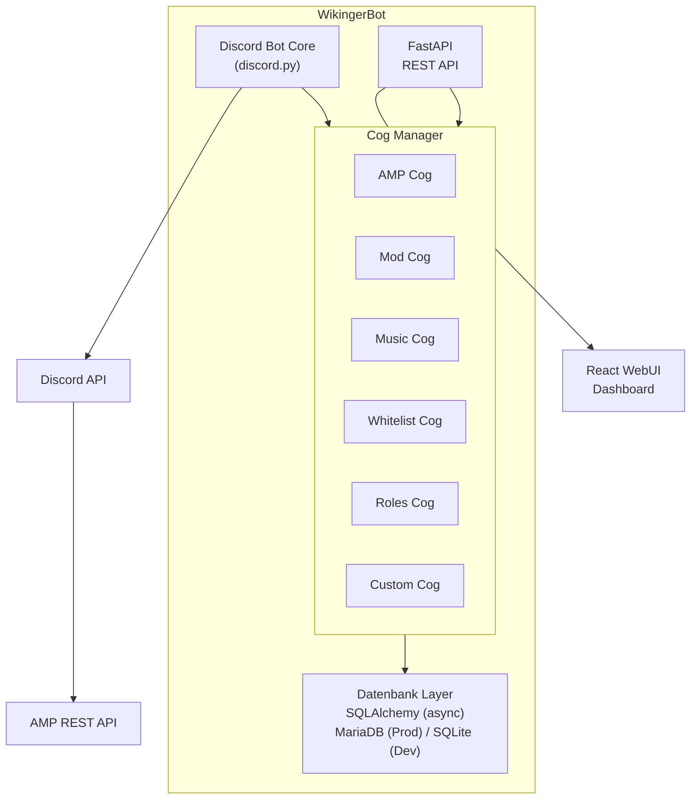

# WikingerBot — Projektdokumentation
*Eigener Discord Bot für den Wikinger Server*

> Für die einmaligen Setup-Schritte (Discord-Bot anlegen, einladen, Rollen-Hierarchie) siehe [SETUP.md](SETUP.md).
> Für eine vollständige Liste aller Slash-Commands mit Beschreibung und benötigtem Berechtigungslevel siehe [COMMANDS.md](COMMANDS.md).
> Für die Nutzung des Status-Banners siehe [BANNER.md](BANNER.md), für die Konsolen-Filter/Event-Erkennung (inkl. Regex-Grundlagen) siehe [CONSOLE_FILTERS.md](CONSOLE_FILTERS.md).
> Für die Anleitung, ein neues Cog (inkl. optionaler WebUI-Seite) zu erstellen, siehe [CREATING_A_COG.md](CREATING_A_COG.md).

---

## Projektstatus

| Phase | Inhalt | Status |
|---|---|---|
| Phase 1 | Bot Core, Cog-Manager, Datenbankmodelle, Berechtigungssystem, FastAPI-Grundstruktur | ✅ fertig |
| Phase 2 | `amp`-Cog, `moderation`-Cog, `whitelist`-Cog | ✅ fertig |
| — | Konsolen-Filter (Blacklist/Whitelist) + Event-Kanal für den `amp`-Cog | ✅ fertig |
| — | `banner`-Cog (Embed/Bild-Banner, Steam-Artwork, Banner-Gruppen, Editor-UI) | ✅ fertig |
| Phase 3 | React-WebUI | ✅ läuft in AMP im Bot-Prozess (https über das Edge-Gateway): Dashboard, Server, Moderation, Whitelist, Einstellungen, Musik, Begrüßung; Benutzer-Seite offen |
| — | Betrieb in AMP: eigene Vorlage, Migrationen beim Start, MariaDB getestet ([AMP.md](AMP.md)) | ✅ fertig |
| Phase 4 | `welcome`, `roles`, `music`, `stats`, `automod` | ✅ fertig (Tests ohne Discord; live in Discord noch zu prüfen) |
| Phase 5 | Kopplung mit der Community-Seite als eigene, abschaltbare Cogs | 🔜 `community` (Verknüpfen, Auftrags-Abholung), `news`, `events`, `tickets`, `rangsync`, `wiki` und `ampkonten` fertig |

Phase 1–3 sind gegen einen echten AMP-Server und einen Test-Discord-Server live verifiziert (nicht nur Unit-Tests). Die Phase-4-Cogs sind mit Unit-Tests abgesichert (Befehle laden, Regeln, Datenbank, echter FFmpeg-Lauf), aber noch nicht in Discord ausprobiert.

Grundsatz: Der Bot läuft auch **ohne** die Community-Seite – alles, was mit ihr zusammenarbeitet, kommt in eigene Cogs, die man weglassen kann.

---

## Projektziel

Ablösung von GatekeeperV2, Red Discord Bot und Sinusbot durch einen einheitlichen, selbst entwickelten Bot mit:
- Einheitlichem Berechtigungssystem
- Einheitlicher Datenbank
- Discord Slash-Commands als primäres Interface
- WebUI für detaillierte Konfiguration und Übersichten
- Cog-basierter Erweiterbarkeit

---

## Tech-Stack

| Komponente | Technologie | Begründung |
|---|---|---|
| Sprache | Python 3.11+ | Ausgereift, Red als Referenz, gute AMP-Unterstützung |
| Discord Library | discord.py | Größte Community, beste Dokumentation |
| REST API / Backend | FastAPI | Async-nativ, automatische API-Docs, sauber trennbar |
| WebUI Frontend | React | Modern, erweiterbar, bereits bekannt |
| Datenbank (Prod) | MariaDB | Läuft bereits in k3s |
| Datenbank (Dev) | SQLite | Einfach, kein Overhead lokal |
| ORM | SQLAlchemy (async) | Unterstützt MariaDB und SQLite, Datenbankwechsel einfach |
| AMP Integration | ampapi (Python) | Offizieller Wrapper für CubeCoders AMP REST API |
| Hosting | k3s oder AMP-Instanz | Beides möglich |

---

## Architektur-Übersicht



---

## Ordnerstruktur

Tatsächlicher aktueller Stand (Phase 1–4). `docker/`, `k8s/` aus der ursprünglichen Planung existieren
noch nicht.

Ein Cog kann optional `api.py` (FastAPI-Router) und/oder `web/` (React-
Seite) mitbringen — beides wird automatisch eingesammelt, siehe
[CREATING_A_COG.md](CREATING_A_COG.md). `package.json`/`node_modules`
liegen bewusst im Repo-Root, nicht in `web/`, damit Node/TypeScript sie
auch von `bot/cogs/*/web/*` aus findet (gemeinsamer Vorfahre).

```
Wikingerbot/
├── bot/
│   ├── main.py                 # Einstiegspunkt
│   ├── core/
│   │   ├── bot.py              # Bot-Klasse, Cog-Manager
│   │   ├── config.py           # Konfiguration (Env-Variablen)
│   │   ├── base_cog.py         # BaseCog
│   │   ├── permissions.py      # Berechtigungssystem (Level, require_role, ...)
│   │   ├── amp_client.py       # AMP-Controller-/Pro-Instanz-Sessions
│   │   ├── console_filters.py  # Eingebaute Konsolen-Filter-/Event-Muster
│   │   ├── entities.py         # ensure_guild/ensure_user (FK-Sicherheit)
│   │   ├── guild_config.py     # GuildConfig get/set
│   │   ├── bot_settings.py     # BotSetting get/set (globale, nicht guild-gebundene Schalter)
│   │   ├── steam_art.py        # Steam-Store-Artwork ueber die App-ID (aus AMPs DisplayImageSource) - von amp+banner-Cog genutzt
│   │   └── discord_utils.py    # send_temp_followup (auto-loeschende Ephemeral-Replies)
│   └── cogs/
│       ├── admin/cog.py        # /bot cog ..., /bot sync, /bot sync_on_startup
│       ├── amp/
│       │   ├── cog.py           # /server ... (Start/Stop/Status/Console/Chat-Bridge/Filter/Steam-AppID)
│       │   ├── api.py           # FastAPI-Router: GET /servers (Dashboard-Daten)
│       │   └── web/             # React-Seite: DashboardPage.tsx, api.ts, ServerCard.tsx, types.ts
│       ├── moderation/cog.py   # /kick /ban /timeout /warn /modlog /modconfig
│       ├── welcome/             # /welcome ... (Begruessung, DM, Abschied) + Web-Seite
│       ├── roles/cog.py         # /rollen auto ... /rollen panel ... (Autorole, Selbstwahl-Knoepfe)
│       ├── music/               # /musik ... /musikconfig ... (Radio, Dateien, Podcasts) + Web-Seite
│       ├── stats/               # /stats ... (Aktivitaet, Mitgliederzaehler)
│       ├── automod/             # /automod ... (Discords AutoMod + eigene Regeln) + Web-Seite
│       ├── community/cog.py     # /verknuepfen /profil /community status (nur mit Seiten-DB)
│       ├── news/                # News der Seite in Discord (+ Web-Seite)
│       ├── events/              # Events mit Zusage-Knoepfen + natives Discord-Event (+ Web-Seite)
│       ├── tickets/             # Tickets: Staff-Threads, DMs, /ticket (+ Web-Seite)
│       ├── rangsync/            # Raenge der Seite <-> Discord-Rollen (+ Web-Seite)
│       ├── wiki/cog.py          # /wiki (Suche im Wiki der Seite)
│       ├── ampkonten/           # AMP-Konten fuer Mitglieder der Seite (+ Web-Seite)
│       ├── whitelist/cog.py    # /whitelist ...
│       └── banner/              # /banner ... /bannergroup ... (Status-Banner, Editor-UI)
│           ├── cog.py           # Commands, Views, Posting-/Update-Loop
│           ├── themes.py        # Eingebaute Verlaufs-Themes, Presets, Blur-Level
│           ├── image.py         # Pillow-Rendering der Bild-Banner-Variante
│           └── embed.py         # Embed-Rendering der Embed-Banner-Variante
│
├── bot/community/               # gemeinsam fuer die Community-Cogs: Seiten-DB, Outbox-Verteiler, Verknuepfung
├── api/                         # FastAPI Backend
│   ├── main.py                  # CORS, sammelt Cog-Router ein
│   ├── cog_routers.py           # discover_cog_routers() - analog zu discover_cogs() fuer Discord-Cogs
│   ├── routers/
│   │   ├── health.py
│   │   └── auth.py             # Discord-OAuth2-Login, /auth/me
│   └── middleware/auth.py
│
├── web/                         # React-Frontend (Vite + TypeScript, SPA)
│   ├── vite.config.ts           # root=web/, Alias "@"->src/, fs.allow fuer bot/cogs/*/web
│   ├── index.html
│   └── src/
│       ├── main.tsx, App.tsx    # App.tsx sammelt Cog-Seiten per import.meta.glob() automatisch ein
│       ├── api/                  # gemeinsamer fetch-Wrapper + Auth-API
│       ├── auth/                 # AuthProvider/RequireAuth (Login-Status, Route-Guard)
│       └── pages/Login.tsx       # einzige zentrale Seite (kein Cog-Bezug)
│
├── db/
│   ├── base.py                  # SQLAlchemy Base
│   ├── session.py                # DB Session Management (get_db_session fuer Cogs, get_db fuer FastAPI)
│   ├── models/                   # siehe Datenbankschema oben
│   └── migrations/               # Alembic
│
├── tests/
├── package.json                 # Node-Root (siehe Hinweis oben zu node_modules)
├── .env.example
├── SETUP.md
├── COMMANDS.md
├── BANNER.md
├── CONSOLE_FILTERS.md
├── CREATING_A_COG.md
└── requirements.txt
```

**Noch nicht existent** (Phase 4): `docker/`, `k8s/` — sobald die
tatsächliche Hosting-Umsetzung beginnt, werden sie analog zur
ursprünglichen Planung ergänzt.

---

## Cog-Interface

Jedes Cog erbt von `BaseCog` (`bot/core/base_cog.py`):

```python
class BaseCog(commands.Cog):
    """Basis-Klasse fuer alle WikingerBot Cogs."""

    __cog_name__: str
    __version__: str
    __description__: str
    __author__: str

    def __init__(self, bot: commands.Bot) -> None:
        self.bot = bot
        self.config = settings  # bot/core/config.py, schreibgeschuetzt

    async def cog_load(self) -> None: ...
    async def cog_unload(self) -> None: ...
```

Abweichung von der ursprünglichen Planung: kein `self.db` (eine langlebige
DB-Session wäre ein Anti-Pattern für async SQLAlchemy) und kein `cog_check`
(gilt für klassische Prefix-Commands; wir nutzen Slash-Commands, daher läuft
die Berechtigungsprüfung über den `@require_role(...)`-Decorator direkt am
Command, siehe `bot/core/permissions.py`).

Groups (`app_commands.Group`, z.B. `/server`, `/bot`, `/whitelist`) müssen als
**Klassen-Attribut** definiert werden, nicht als Modul-Level-Variable —
sonst bindet discord.py sie nicht korrekt an die Cog-Instanz.

**Cog laden/entladen per Discord-Command:**
```
/bot cog load name:moderation
/bot cog unload name:moderation
/bot cog reload name:moderation
/bot cog list
/bot sync local:True
```

---

## Datenbankschema

Das tatsächliche Schema lebt als SQLAlchemy-Modelle in `db/models/` (nicht
hier als SQL dupliziert, damit diese Doku nicht bei jeder Migration
veraltet). Migrationen liegen in `db/migrations/versions/`. Kurzüberblick
der Tabellen:

| Modell | Datei | Zweck |
|---|---|---|
| `Guild` | `guild.py` | Bekannte Discord-Server |
| `User` | `user.py` | Discord-Nutzer, inkl. zuletzt genutztem IGN, Donator-Status |
| `GuildRole` | `role.py` | Discord-Rolle → Berechtigungslevel |
| `Server` | `server.py` | AMP-Instanz, Kanäle, Konsolen-Filter-Modus, Banner-Konfiguration, Steam-App-ID |
| `BannerGroup` | `banner_group.py` | Mehrere Server in einem gemeinsamen Banner (kombiniert oder je Mitglied einzeln) |
| `ConsolePattern` / `ConsolePatternOverride` | `console_pattern.py` | Eigene Regex-Muster / deaktivierte eingebaute Muster |
| `ModLogEntry` / `Warning` | `modlog.py` | Moderationshistorie, Verwarnungen mit Punktesystem |
| `WhitelistRequest` | `whitelist.py` | Whitelist-Anfragen inkl. Review-Nachricht |
| `GuildConfig` | `config.py` | Key-Value-Konfiguration pro Guild |
| `BotSetting` | `bot_setting.py` | Key-Value-Konfiguration global (nicht guild-gebunden), z.B. `sync_globally_on_startup` |
| `WebSession` | `web_session.py` | Refresh-Tokens für den WebUI-Login (Phase 3, noch ungenutzt) |

---

## Berechtigungssystem

```
Owner   → Alles, kann Admins ernennen
Admin   → Alles außer Owner-Aktionen, kann Mods ernennen
Mod     → Moderation, Server steuern, Whitelist verwalten
Member  → Status sehen, Whitelist beantragen, Chat
```

Implementierung als Decorator (`bot/core/permissions.py`):

```python
from bot.core.permissions import Level, require_role

@app_commands.command()
@require_role(Level.MOD)        # Mindestens Mod
async def kick(self, interaction, user: discord.Member, reason: str):
    ...

@app_commands.command()
@require_role(Level.OWNER)      # Nur Owner (oder Discord-Administrator)
async def server_add(self, interaction, ...):
    ...
```

Für `discord.ui.View`-Button-Callbacks (z.B. Whitelist-Accept/Deny,
Warn-Eskalations-Buttons) gibt es das Pendant `check_level_interaction(...)`,
da `require_role` auf `app_commands.Command` zugeschnitten ist.

---

## Cogs (v1)

| Cog | Ersetzt | Features | Status |
|---|---|---|---|
| `amp` | GatekeeperV2 | Start/Stop/Status, Console-/Chat-Bridge, Konsolen-Filter, Event-Kanal | ✅ fertig |
| `moderation` | Red (teilweise) | Kick/Ban/Warn/Timeout, ModLog, automatische Warn-Eskalation | ✅ fertig |
| `whitelist` | GatekeeperV2 | Anfragen über Accept/Deny-Buttons, AMP-Whitelist, Rollen-Vergabe | ✅ fertig (kein Auto-Approve, immer Mod-Freigabe) |
| `banner` | GatekeeperV2 | Embed-/Bild-Status-Banner, Steam-Artwork, Banner-Gruppen (kombiniert/einzeln), Editor-UI | ✅ fertig |
| `roles` | Red (teilweise) | Autorole (nach Regel-Screening), Selbstwahl-Rollen per Knopf | ✅ fertig |
| `welcome` | Red (teilweise) | Begrüßung mit Platzhaltern, Willkommens-DM, Abschiedsmeldung | ✅ fertig |

**Spätere Cogs (v2+):**

| Cog | Features | Status |
|---|---|---|
| `music` | Ersetzt Sinusbot: Radio-Streams (inkl. .m3u/.pls), eigene Dateien, Podcasts (RSS) – bewusst ohne YouTube, Spotify und Aufnahme | ✅ fertig |
| `stats` | Beitritte/Austritte, Nachrichten, Voice-Zeit, Top-Mitglieder, Mitgliederzähler-Kanal – nur Anzahlen, nie Inhalte | ✅ fertig |
| `automod` | Warn-Punkte aus Discords AutoMod (früher in `moderation`) und eigene Regeln, die Discord nicht kann: Flut, Wiederholung, Großbuchstaben, Emojis, Link-Allowlist, junge Konten; eigener Tab | ✅ fertig |
| `trivia` | Quiz-System | vorerst nicht geplant |

---

## WebUI Seiten

| Seite | Inhalt |
|---|---|
| Dashboard | Server-Übersicht, Online-Status, Spielerzahlen |
| Musik | Jetzt läuft, Steuerung, Radio/Podcasts/Dateien abspielen; Admin: Sender und Podcasts |
| Begrüßung | Begrüßung, DM und Abschied mit Vorschau (Admin) |
| AutoMod | Discords AutoMod → Warn-Punkte, eigene Regeln, Folgen, Ausnahmen, Alarmkanal (Admin) |
| Community | Anbindung an die Community-Seite (Owner) |
| News | News-Kanal, Ping-Rolle, neueste News mit Discord-Stand (Admin) |
| Events | Event-Kanal, Ping-Rolle, natives Discord-Event, nächste Events mit Discord-Stand (Admin) |
| Tickets | Staff-Kanal, Ping-Rolle, DMs, offene Tickets mit Thread-Stand (Admin) |
| Rang-Sync | Rang ↔ Discord-Rolle und Richtung, Ersteller für System-Tickets, alles abgleichen (Owner) |
| AMP-Konten | Panel-Adresse, Rang → AMP-Rolle, angelegte Konten (Owner) |
| Server | AMP-Instanzen verwalten, Start/Stop, Console-Log |
| Moderation | ModLog ansehen, Verwarnungen, gebannte User |
| Whitelist | Anfragen verwalten, genehmigen/ablehnen |
| Benutzer | User-Datenbank, Rollen, Steam-IDs |
| Einstellungen | Bot-Konfiguration, Cogs laden/entladen |

Aktueller Stand: Alle Seiten außer „Benutzer“ sind fertig. Im Betrieb läuft die
Oberfläche im Bot-Prozess (`api/server.py`: API unter `/api`, gebautes Frontend
unter `/`), siehe [AMP.md](AMP.md). Discord-IDs gehen in der API immer als Text
raus (`api/types.Snowflake`) – als Zahl würde JavaScript sie runden.

### Lokal entwickeln

Zwei Prozesse parallel, aus dem Repo-Root:

```
# Backend
.venv/Scripts/python.exe -m uvicorn api.main:app --reload --port 8000

# Frontend (erstmalig: npm install)
npm run dev
```

Frontend läuft auf `http://localhost:5173`, Backend auf
`http://localhost:8000`. `web/.env.development` braucht `VITE_DISCORD_GUILD_ID`
(Guild, gegen die eingeloggt wird — ein Login ist wie beim Bot selbst
aktuell auf eine Guild pro Session festgelegt). Discord-Developer-Portal
braucht `http://localhost:8000/auth/callback` als eingetragene Redirect-URI
(siehe [SETUP.md](SETUP.md)).

Python- (`requirements.txt`/`.venv`) und Node-Tooling (`package.json`/
`node_modules`, bewusst im Repo-Root statt in `web/` — siehe
[CREATING_A_COG.md](CREATING_A_COG.md)) laufen unabhängig nebeneinander,
einziger Berührungspunkt sind die beiden Ports plus `cors_origins`/
`frontend_url` in `bot/core/config.py`.

---

## Hosting

### Option A — k3s (empfohlen)
```yaml
# 3 Deployments:
# - wikingerbot-discord   (Bot Core)
# - wikingerbot-api       (FastAPI)
# - wikingerbot-web       (React via nginx)
# + MariaDB bereits vorhanden
```

### Option B — AMP-Instanz (umgesetzt)
Eigene AMP-Vorlage nach dem Vorbild von GatekeeperV2 im Repo
[Daywalker91/AMPTemplate](https://github.com/Daywalker91/AMPTemplate): Code als ZIP von
`main`, eigenes venv, Einstellungen als Eingabefelder in AMP (AMP schreibt daraus die
`.env`), Datenbank-Migrationen beim Start. Anleitung: [AMP.md](AMP.md).
Die Web-Oberfläche läuft im selben Prozess mit; das gebaute Frontend kommt per GitHub Action als `webui.zip`.

---

## Entwicklungsplan

**Phase 1 — Grundgerüst** ✅
- Bot Core + Cog-Manager
- Datenbankmodelle + Migrationen
- Berechtigungssystem
- FastAPI Grundstruktur

**Phase 2 — Kern-Cogs** ✅
- AMP Cog (ersetzt GatekeeperV2) inkl. Konsolen-Filter + Event-Kanal
- Moderation Cog
- Whitelist Cog
- Banner Cog (Embed/Bild, Steam-Artwork, Banner-Gruppen, Editor-UI)

**Phase 3 — WebUI** ✅
- Dashboard, Server, Moderation, Whitelist, Einstellungen, Musik, Begrüßung
- Betrieb in AMP im Bot-Prozess, https über das Edge-Gateway
- offen: Benutzer-Seite

**Phase 4 — Erweiterungen** ✅
- welcome, roles, music, stats, automod

**Phase 5 — Community-Seite** (offen)
- `community` (Konto-Verknüpfung, Aufträge der Seite), Rollen-Sync, `tickets`, `news`, `events`

---

*WikingerBot | Daywalker91 | Stand: Oktober 2026*
