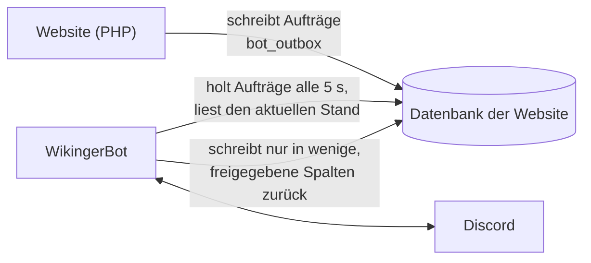

# Community-Website anbinden – wer macht was, wo und wie

Diese Anleitung beschreibt die Kopplung des WikingerBot mit einer **Community-Website**
(Konten, News, Events, Tickets, Forum, Wiki, Ränge). Sie richtet sich an alle, die dabei
etwas einrichten: Betreiber der Website, Datenbank-Admin, Bot-Owner und Discord-Admins.

Grundsatz: **Der Bot läuft auch ohne Website.** Alles, was mit ihr zusammenarbeitet, steckt
in eigenen Cogs (`community`, `news`, `events`, `tickets`, `forum`, `wiki`, `rangsync`,
`ampkonten`, `rollenanfragen`). Ohne Anbindung tun sie nichts.

---

## 1. Wie die Kopplung funktioniert

Website und Bot reden **nicht per HTTP** miteinander, sondern über die **Datenbank der
Website**:

- **Website → Bot:** Ändert sich etwas, das Discord betrifft (News gespeichert, Ticket
  beantwortet, Rang geändert …), schreibt die Website einen **Auftrag** in die Tabelle
  `bot_outbox`. Der Auftrag enthält nur IDs (z.B. `{"news_id": 12}`), den Inhalt liest der
  Bot selbst nach. Nicht zugestellte Aufträge versucht er bis zu fünfmal erneut.
- **Bot → Website:** Der Bot schreibt nur dort, wo er muss (Verknüpfung, Zusagen zu
  Events, Ticket-Antworten aus Discord, Entscheidungen zu Rollenanfragen, Stand des
  AMP-Zugangs). Seine Datenbankrechte sind **spaltengenau** – er sieht z.B. weder E-Mail
  noch Passwort-Hash.
- **Konten verknüpfen:** Mitglieder verbinden ihr Website-Konto einmal mit Discord (Code
  auf der Website, `/verknuepfen CODE` in Discord). Erst dann weiß der Bot, wer wer ist.
- **Uhrzeit:** `NOW()` der Datenbank ist die gemeinsame Uhr. Event-Zeiten speichert die
  Website in ihrer Ortszeit (Bot-Einstellung `TIMEZONE`, Standard `Europe/Berlin`).

---

## 2. Wer ist beteiligt?

| Wer | Zuständig für | Wo |
|---|---|---|
| **Website-Betreiber** | Website installieren und aktuell halten, Anbindung einschalten | Webserver, `config.local.php` der Website |
| **Datenbank-Admin** | Datenbank-Benutzer für den Bot, Rechte, Firewall | MariaDB/MySQL (z.B. phpMyAdmin) |
| **Bot-Owner** | Verbindung zur Website eintragen, Cogs einstellen | Bot-Oberfläche (Tabs *Community*, *News*, *Events* …) |
| **Discord-Admin** | Kanäle, Foren, Rollen und Rechte für den Bot | Discord-Servereinstellungen |
| **Mitglieder** | Konto verknüpfen | Website: *Einstellungen → Discord*, Discord: `/verknuepfen` |

Oft ist das ein und dieselbe Person – die Schritte bleiben trotzdem in dieser Reihenfolge.

---

## 3. Einrichtung Schritt für Schritt

| # | Wer | Wo | Was |
|---|---|---|---|
| 1 | Website-Betreiber | Webserver | Website auf den aktuellen Stand bringen. Ihre Migrationen laufen beim nächsten Seitenaufruf von selbst (Discord-Anbindung ab `008_discord`). |
| 2 | Datenbank-Admin | Datenbank | Einen eigenen Benutzer für den Bot verwenden (z.B. denselben wie für die Bot-Datenbank) und ihm die Rechte aus [community-grants.sql](community-grants.sql) geben – Platzhalter `<SITE_DB>`, `<BOT_USER>`, `<BOT_HOST>` ersetzen. Firewall: Bot-Rechner → Datenbank, Port 3306. |
| 3 | Bot-Owner | Bot-Oberfläche → **Community** | Datenbankname der Website und ihre öffentliche Adresse (z.B. `https://community.example.com`) eintragen, *Speichern und verbinden*. Liegt die Website-Datenbank auf einem anderen Server oder soll ein eigener Benutzer sie lesen: unter *Datenbank-Server der Seite* Server, Port, Benutzer, Passwort. Die Seite zeigt sofort, ob Verbindung und Rechte passen – ein Neustart ist nicht nötig. |
| 4 | Website-Betreiber | `config.local.php` der Website | **Erst jetzt** `'discord_enabled' => true` setzen. Vorher würde die Website Aufträge schreiben, die niemand abholt. |
| 5 | Discord-Admin | Discord | Kanäle anlegen (News, Events, Forum-Ankündigungen, Tickets als Forum, Modlog) und dem Bot dort Sehen, Schreiben, Einbetten erlauben; für Tickets zusätzlich Threads verwalten, für Discord-Events *Events verwalten*, für Rang-Sync *Rollen verwalten* (die Bot-Rolle muss über den Rollen stehen, die er vergibt). |
| 6 | Bot-Owner | Bot-Oberfläche, je Tab | Kanäle, Ping-Rollen und Abläufe einstellen – siehe Abschnitt 4. |
| 7 | Mitglieder | Website + Discord | *Einstellungen → Discord* → Code erzeugen (8 Zeichen, 15 Minuten gültig) → in Discord `/verknuepfen CODE`. |

Prüfen: In Discord `/community status` oder im Tab *Community* – dort stehen Verbindung,
verknüpfte Mitglieder und offene bzw. fehlgeschlagene Aufträge.

---

## 4. Funktionen: was passiert wo?

| Funktion | Auf der Website | Im Bot / in Discord | Einstellen (Bot-Tab) |
|---|---|---|---|
| **Verknüpfen** | *Einstellungen → Discord*: Code erzeugen, Verknüpfung lösen | `/verknuepfen CODE`, `/verknuepfung_loesen`, `/profil` | *Community* |
| **News** | News schreiben, Haken „In Discord ankündigen“, Kategorien wählen | Beitrag im News-Kanal; Bearbeiten aktualisiert, Löschen/Entwurf entfernt ihn; beim ersten Posten werden die Rollen der Kategorien angepingt (sonst die allgemeine Ping-Rolle) | *News* |
| **Events** | Event anlegen, Kategorien, Haken „Zusagen möglich“ (aus = Info-Termin) | Beitrag mit Zusage-Knöpfen (nur mit verknüpftem Konto und Recht `events.join`), optional natives Discord-Event; Info-Termine ohne Knöpfe | *Events* |
| **Kategorien** | *Verwaltung → Kategorien* (frei anlegen) | Rollen je Kategorie – gemeinsam für News und Events | *News* oder *Events* |
| **Tickets** | Ticket eröffnen, antworten, Status | je Ticket ein Beitrag im Ticket-Forum (je Kategorie eigenes Forum möglich), Antworten in beide Richtungen, DM ans Mitglied | *Tickets* |
| **Forum** | Thema in öffentlicher Kategorie anlegen | Ankündigung „Neues Thema“ im Kanal, `/forum` | *Forum* |
| **Wiki** | Seiten pflegen | `/wiki` sucht und verlinkt | – |
| **Ränge & Zusatzrollen** | *Verwaltung → Mitglieder* | Rang-Sync gleicht Discord-Rollen an (Richtung je Rolle einstellbar) | *Rang-Sync* (Owner) |
| **Rollenanfragen** | *Einstellungen → Rolle beantragen* (mit Limits) | Anfrage im Ticket/Modlog mit Zustimmen/Ablehnen; Zustimmen vergibt die Rolle auf beiden Seiten | *Rollenanfragen* |
| **AMP-Zugang** | *Einstellungen → AMP*: beantragen, Passwort zurücksetzen | Bot legt das AMP-Konto an, Zugangsdaten per DM; Rangwechsel/Sperre passt es an oder sperrt es | *AMP-Konten* (Owner) |

Die Befehle im Einzelnen stehen in [COMMANDS.md](../COMMANDS.md).

### Aufträge der Website (`bot_outbox.type`)

| Auftrag | Inhalt | Ausgelöst durch | Verarbeitet von |
|---|---|---|---|
| `news.saved` / `news.deleted` | `news_id` | News speichern / löschen | `news` |
| `event.saved` / `event.deleted` | `event_id` | Event speichern, absagen / löschen | `events` |
| `event.participants` | `event_id` | Zusage auf der Website | `events` |
| `ticket.created` / `ticket.message` / `ticket.updated` | `ticket_id` | Ticket eröffnen / Antwort / Status | `tickets` |
| `forum.thread` | `thread_id` | neues Forenthema | `forum` |
| `role.request` | `request_id` | Rollenanfrage gestellt oder zurückgezogen | `rollenanfragen` |
| `user.role` / `user.extra_roles` | `user_id` | Rang bzw. Zusatzrollen geändert | `rangsync`, `ampkonten` |
| `user.banned` / `user.unbanned` | `user_id` | Mitglied gesperrt / entsperrt | `ampkonten` (sperrt bzw. entsperrt den AMP-Zugang) |
| `user.unlinked` | `user_id`, `discord_id` | Verknüpfung auf der Website gelöst | `community` |
| `amp.request` / `amp.reset` / `amp.disable` | `user_id` | AMP-Zugang beantragen / Passwort zurücksetzen / Konto löschen | `ampkonten` |

Aufträge, für die kein Cog geladen ist, bleiben liegen und werden nicht als Fehler gezählt;
die Website räumt erledigte und nie abgeholte Aufträge nach 30 Tagen weg.

---

## 5. Sicherheit

- **Eigener, eng begrenzter Datenbank-Benutzer** – nur die Rechte aus
  [community-grants.sql](community-grants.sql), Host möglichst auf die IP des Bots beschränkt
  statt `'%'`.
- Der Bot vertraut nur **IDs** aus Aufträgen und liest alles Weitere selbst; Rechte
  (z.B. wer Tickets einer Kategorie sehen oder Rollenanfragen entscheiden darf) prüft er
  gegen die Rechte der Website.
- Zusagen, Ticket-Antworten und Rollenanfragen aus Discord gelten **nur für verknüpfte
  Konten** und mit denselben Regeln wie auf der Website (Rechte, Limits, gesperrte Konten).
- Links nach außen baut der Bot aus der eingetragenen Website-Adresse – sie sollte `https://`
  sein.
- Das Datenbank-Passwort für eine eigene Verbindung zeigt die Oberfläche nie wieder an.

---

## 6. Fehlersuche

| Symptom | Ursache / Lösung |
|---|---|
| Tab *Community*: „keine Verbindung“ | Datenbankname, Server oder Firewall falsch; `Access denied` = Benutzer/Host passt nicht (`SELECT user, host FROM mysql.user;`) |
| „Rechte fehlen“ für eine Tabelle | Zeile aus [community-grants.sql](community-grants.sql) fehlt – oder die Migration der Website lief noch nicht (Website einmal aufrufen) |
| Aufträge bleiben „offen“ | `discord_enabled` an, aber der passende Cog ist nicht geladen (`/bot cogs`) |
| Aufträge „fehlgeschlagen“ | Fehlertext steht in `bot_outbox.last_error` und im Bot-Log; meist fehlende Kanal-Rechte in Discord |
| News/Events erscheinen nicht | Kanal im Tab nicht gesetzt, Haken „In Discord ankündigen“ aus oder Entwurf |
| Kein Ping bei News/Events | Rolle im Tab nicht gewählt oder Kategorie ohne Rollen; gepingt wird nur beim ersten Posten |
| „Kategorien nicht lesbar“ | Leserechte auf `announce_categories`, `news_categories`, `event_categories` fehlen |
| Zusage-Knopf: „verknüpfe dein Konto“ | Mitglied hat noch nicht `/verknuepfen` gemacht |
| Rang-Sync tut nichts | Tab *Rang-Sync* nicht eingeschaltet oder Bot-Rolle steht unter der zu vergebenden Rolle |

---

## 7. Eine andere Website anbinden

Die Cogs sind für die zugehörige PHP-Community-Website geschrieben, setzen aber nur deren
**Datenbankschema** voraus, keinen PHP-Code. Eine andere Website kann sich anbinden, wenn
sie dieselben Tabellen und Spalten bereitstellt:

- **Maßgeblich** sind die Tabellendefinitionen in
  [`bot/community/db.py`](../bot/community/db.py) – dort stehen genau die Spalten, die der Bot
  liest oder schreibt – und die Rechte in [community-grants.sql](community-grants.sql).
- **Pflicht für jede Anbindung:** `users` (mit `discord_*`-Spalten), `roles`,
  `role_permissions`, `discord_link_codes`, `bot_outbox` (Aufträge wie in Abschnitt 4,
  `payload` als JSON).
- **Je Funktion zusätzlich:** News `news` (+ `news_categories`, `announce_categories`),
  Events `events`, `event_participants` (+ `event_categories`), Tickets `tickets`,
  `ticket_messages`, Forum `forum_*`, Wiki `wiki_pages`, Zusatzrollen `user_extra_roles`,
  Rollenanfragen `role_requests`, AMP-Zugang `users.amp_*`. Fehlt eine optionale Tabelle,
  läuft der Rest weiter (z.B. Kategorien, Zusatzrollen).
- **Rechte-Namen**, die der Bot prüft: `events.join`, `ticket.create`, `ticket.manage`,
  `ticket.reports`, `ticket.server`, `ticket.roles` sowie `*` für „alles“.
- **Links:** Der Bot verlinkt nach dem Muster `<Adresse>/index.php?p=<seite>&id=<id>`
  (`news.view`, `events.view`, `tickets.view`, `forum.thread`, `wiki.page`, `user`, `settings`). Eine andere Website
  braucht diese Adressen oder Weiterleitungen dorthin.
